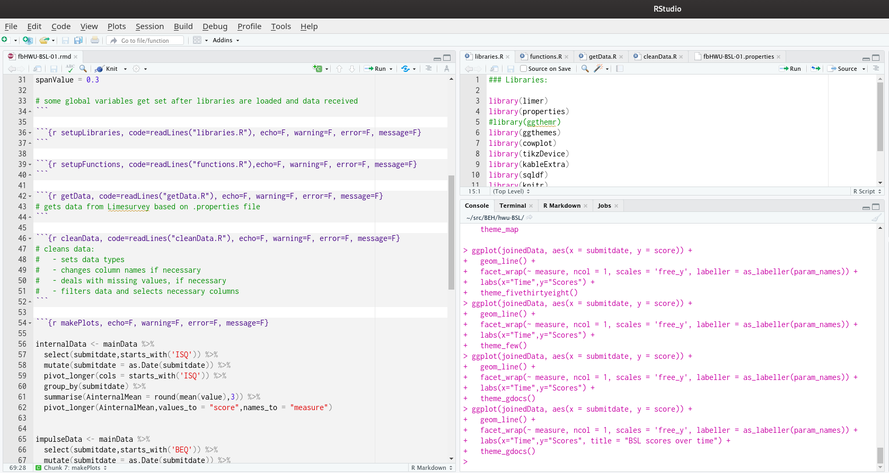

# BSL-23 Monitoring for a PD service

||
|:---:|
| _Scan with your phone to see how it looks from the patient perspective_ |


The **Borderline Symptom List-23** (BSL-23) is a brief, self-report instrument  used to assess the severity of symptoms in BPD. It is the short form of the original 95-item Borderline Symptom List, now known as the BSL-95. 

> The BSL-95 was developed based on DSM-IV-TR criteria for Borderline Personality Disorder (BPD), along with input from clinicians and patients. 
 
The BSL-23 is used extensively to evaluate outcomes and monitor patient response to treatment in certified DBT programs. 

Although the original BSL-95 had very strong psychometric properties, the number of questions in the list was thought to be not practical and to reduce the patent burden and increase the willingness of clinicians and researchers to use the tool, a brief form was created. Research findings by Bohus et al. (2009) have found good psychometric properties for the BSL-23 which are comparable to those found longer BSL-95. There is also a high correlation between the BSL-23 and BSL-95 scores from all samples they tested (range: 0.958–0.963) Internal consistency was also high with Cronbach’s α ranging between 0.935–0.969.

## Clinical Uses

The BSL-23 can be used to test the effectiveness of treatments being undertaken by the patient as it is sensitive enough to detect changes between testings (Bohus et al., 2009). The briefness of the tool allows it to be used weekly with low patient burden, compared to the BSL-95.  The tool was originally written in German and has been translated into several different languages apart from English and the psychometric properties for the translated tools are valid and have been published (Nicastro et al., 2016; Soler et al., 2013).

# Project Structure

Project consists of one main _.Rmarkdown_ script file with extension `.rmd`. There is an identically named file with extension `.properties`. This simple text file contains information such as limesurvey communication parameters and desired `uuid`. Upon reading this file the main script sets the necessary variables. One does not put sensitive information such as your limesurvey API location or `uuid` of interest on public server, therefore this file is excluded from here, but full description of file format and parameters will follow below, therefore you can easily create it yourself.

In order to avoid clutter, the things that you will need to start with - such as loading R libraries, any custom functions and getting/cleaning data are isolated in 4 R scripts with extension `.R`. The main script reads these in at the beginning. An easy work-flow on Rstudio is to open the main file in the leftmost pane and keep the other 4 files in the middle pane above your console.



Reference materials such as information about BSL-23 etc are kept in `reference` directory. `img` directory contains illustrations to this README and future documentation.

`.gitignore` file lists those files and directories that are not kept track of for the project.

## Structure of .properties file

**Naming:** if the main file is called `fbHWU-BSL-01.rmd` then the properties file should be called `fbHWU-BSL-01.properties`. It should be read from the `getData.R` script - the names should match. In later commits I will add automatic filename awareness, however for now - see that the file is correctly referred to in `getData.R` (on line 2).

All lines starting with `#` are comments - and therefore ignored by R. You can copy the below code and create your own `.properties` file; I believe the comments explain everything. The values given here are bogus, you will need to replace what is on the right from equal signs (`=`) with your own parameters.

> A note for colleagues - when working with (programming) code file (including modifying the properties file) one uses _plain text editors_ such as Notepad, Notepad++, Sublime Text, Atom, Espresso. You will have at least one editor on your computer by default - this should be Notepad on windows or TextEdit on mac. Do not ever attempt to use Word as a text editor; it will end in confusion. To read on plain text one can see [Wikipedia](https://en.wikipedia.org/wiki/Plain_text) or a very brief note on [Computerhope](https://www.computerhope.com/jargon/p/plaintex.htm). _(You can of course open the file in Word (although that is unneeded), just do not try to save the file.)_
 
### the .properties file itself

```{txt}

# CHANGE IF NECESSARY: #########################################

# UUID (unique ID) for that person who you want the report on.
# column / survey field name where uuid is contained
uuid=00b2c3
uuidColumn=QUUID

# Dates for which feedback is analysed ########################
# Date Time Formats: ##########################################
# Date: yyyy-mm-dd   e.g. 2018-10-01 is 1st Oct 2018
# Time: hh:mm        according to 24 hour clock

dateStart=2019-10-08
timeStart=00:00
dateEnd=2021-09-15
timeEnd=23:30

################################################################
################################################################
# DO NOT TOUCH - variables to communicate with limesurvey
################################################################
limeAPI=https://your.server.org/index.php/admin/remotecontrol
limeUser=your_read_only_lime_user
limePassword=password_for_that_user
limeSurveyNumber=111199

# you need to have access to a limesurvey installation
# so that you know correct parameters
# ordinary user not expected to make changes here
# for ordinary use one just needs to change uuid (and maybe dates)


```
